# Administration Menu

As the first operation after setting up your preferences, you should create Categories for your events:

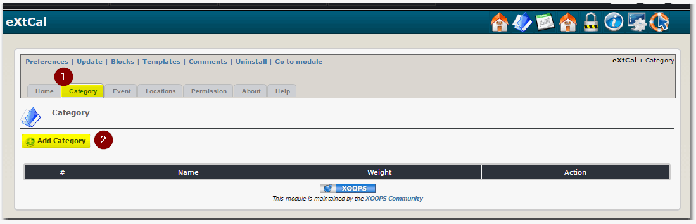

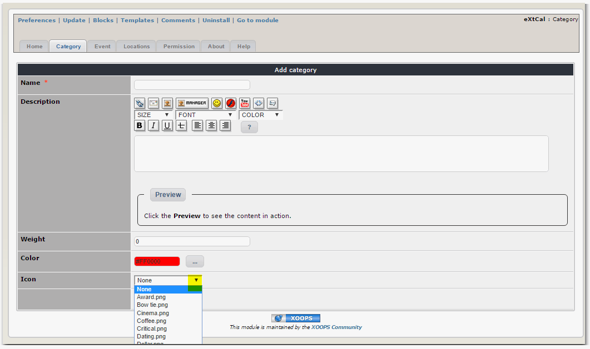

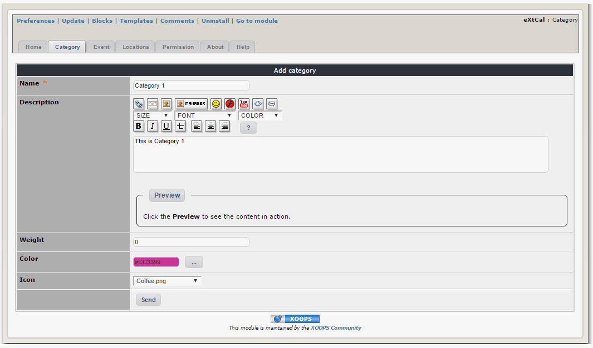

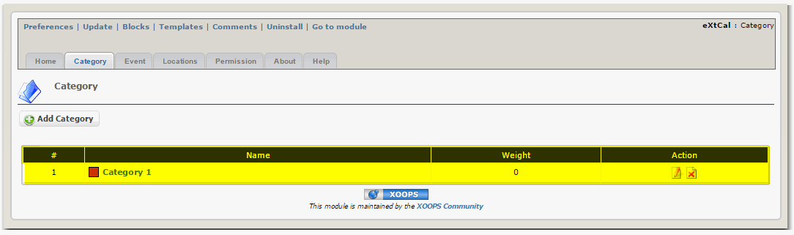

## Adding Category

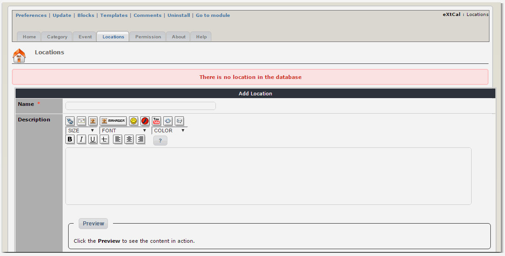

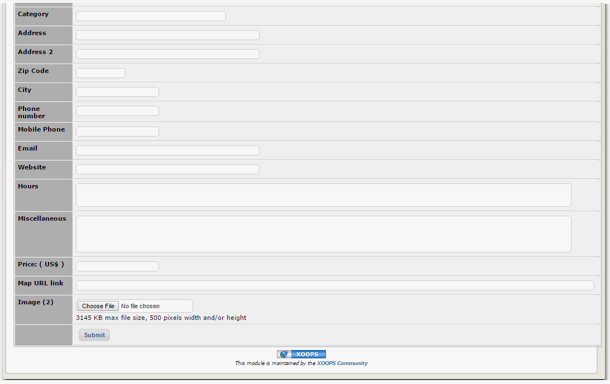

## Adding Location

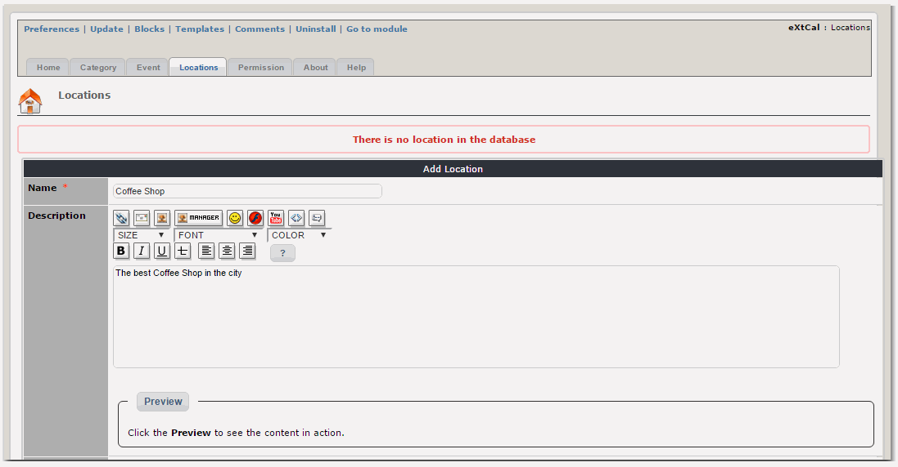

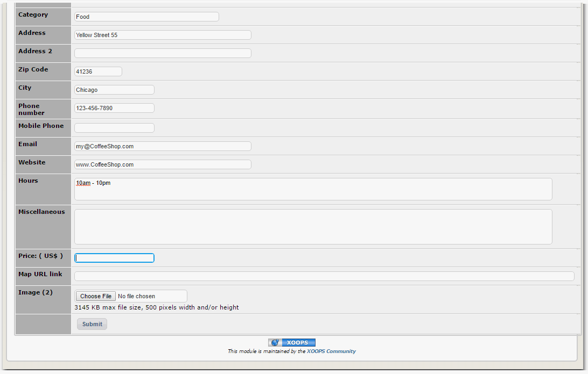

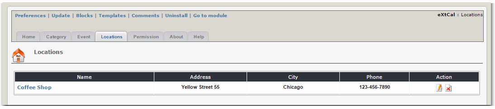

## Adding Permissions

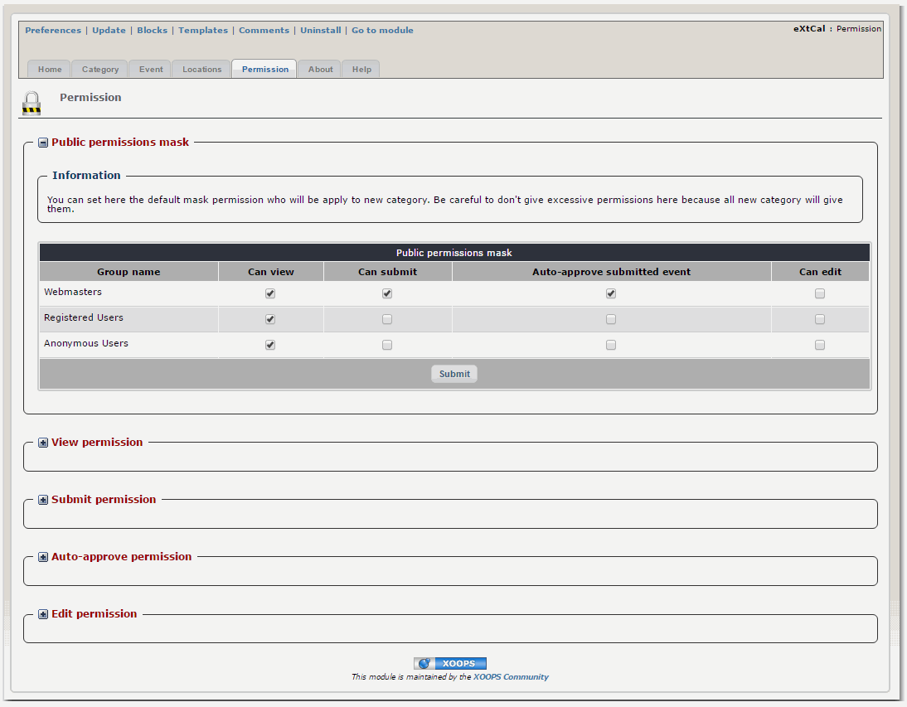

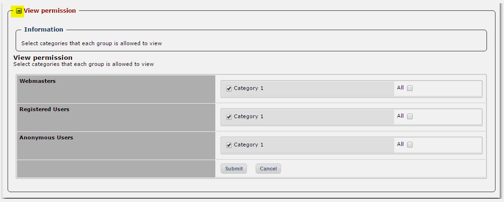

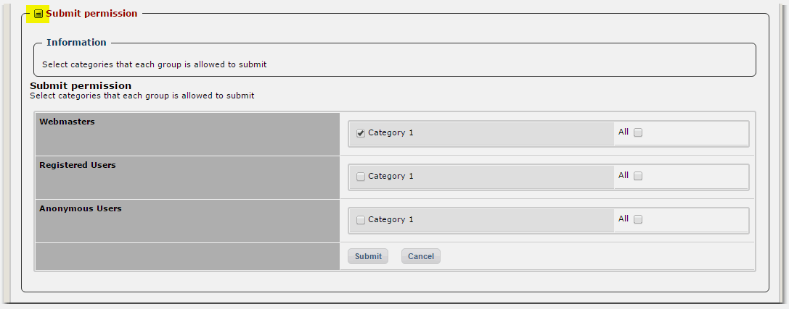

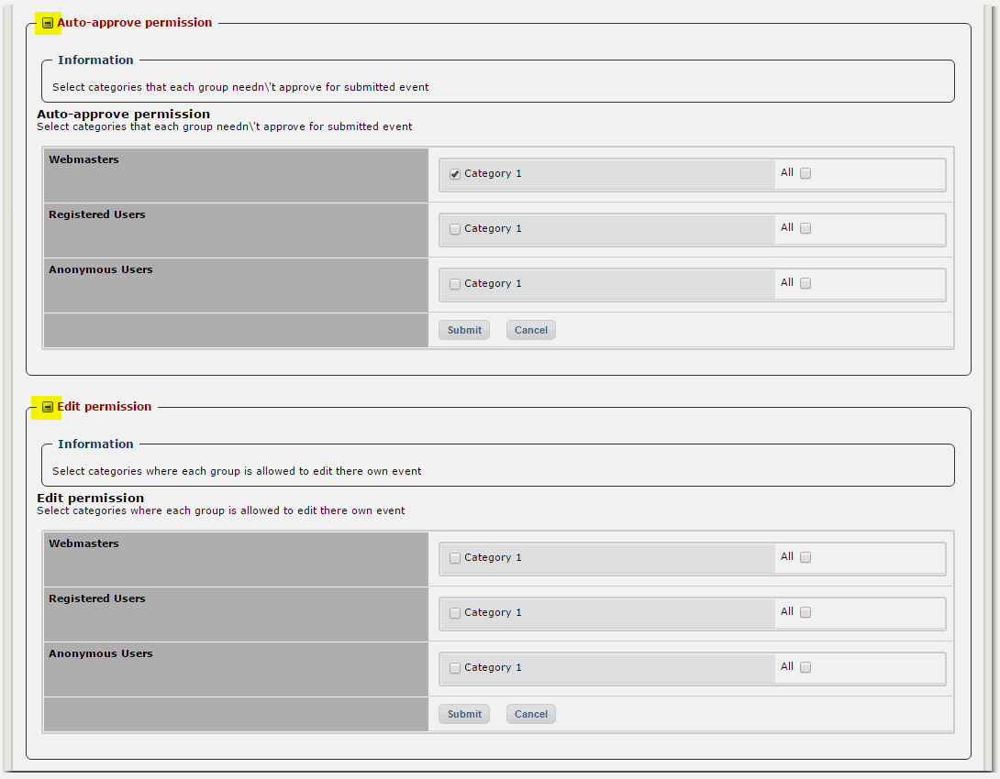

## Adding Event

   

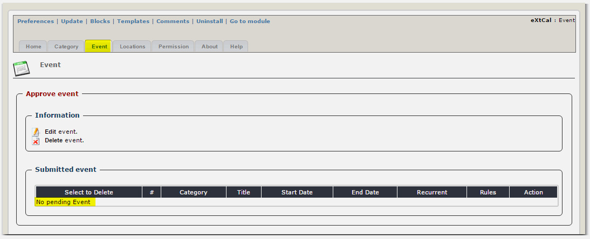

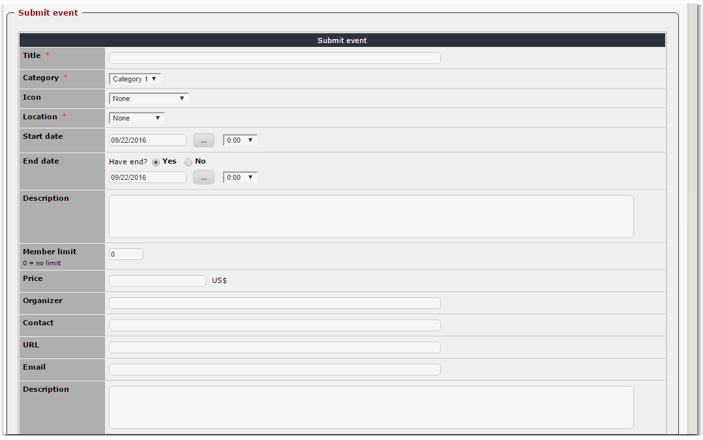

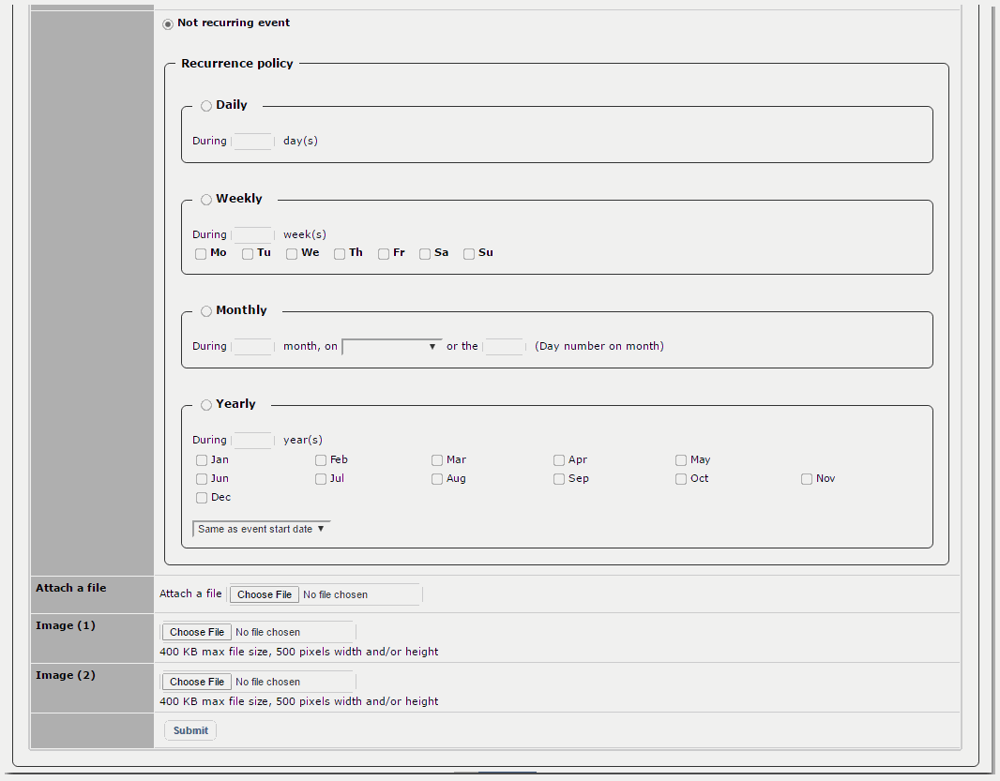

