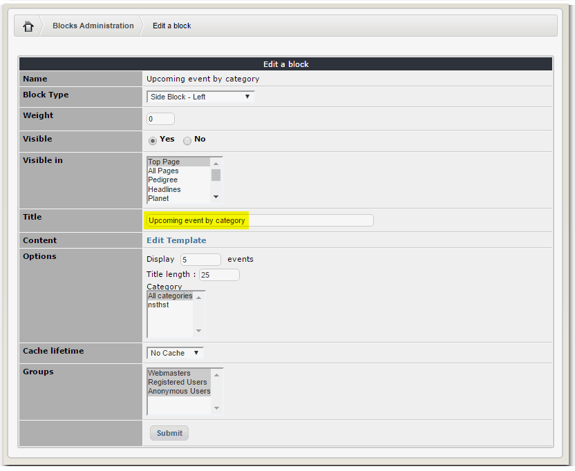

# Blocks

**extCal** module has 6 blocks available to use:

| Block | Description |
| --- | --- |
| MiniCal |  |
| Upcoming event |  |
| Today's events |  |
| New Event |  |
| Random events |  |
| Upcoming event by category |  |

## MiniCal

 

## Upcoming event

## Today's events

## New Event

## Random events

## Upcoming event by category

