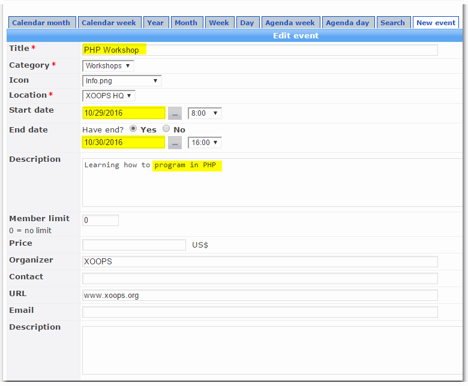
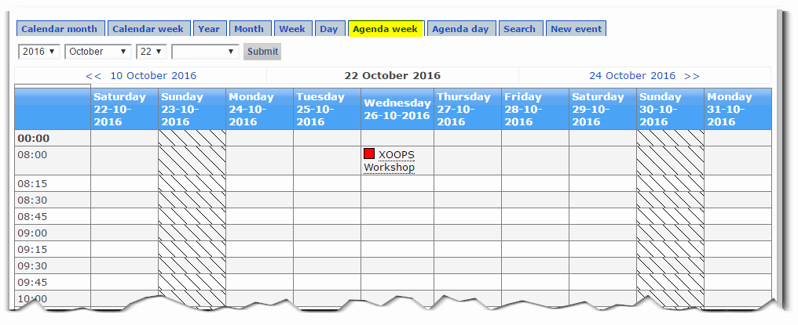

# 4.0 Operating Instructions

#### New event

If you have the required permissions, you can add a new event:

#### Cloning event

Cloning an event is a big time-saver, if you have a similar event and would like to only change a date and few minor details.

First select the event that you would like to clone, and then click on the "clone" icon: 

