# The User Side

## Calendar month

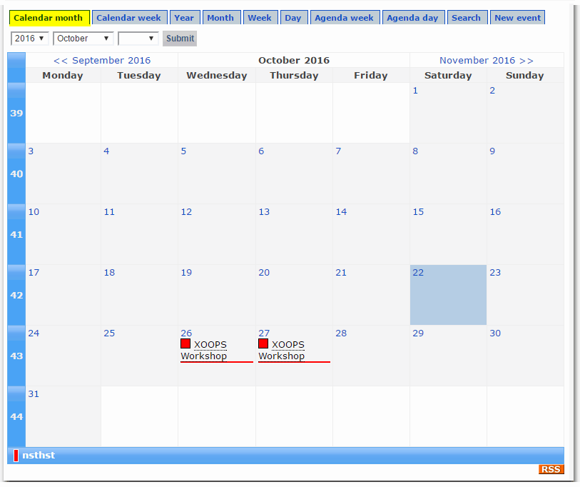

## Calendar week

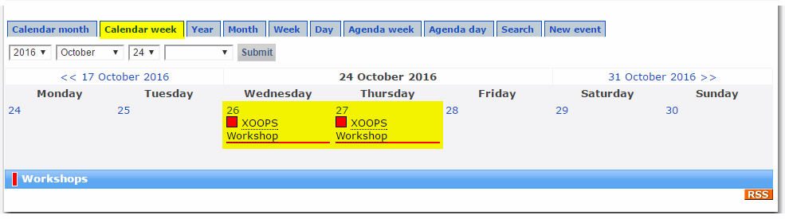

## Year \(list view\)

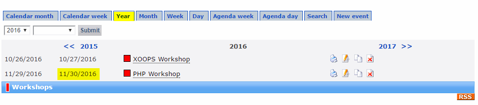

## Month \(list view\)

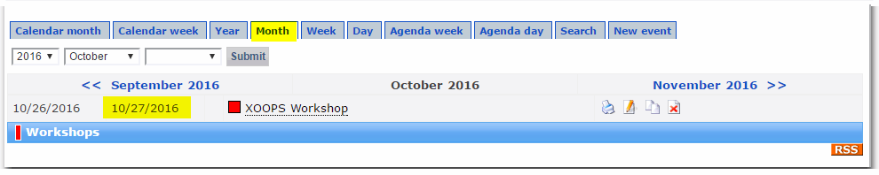

## Week \(list view\)

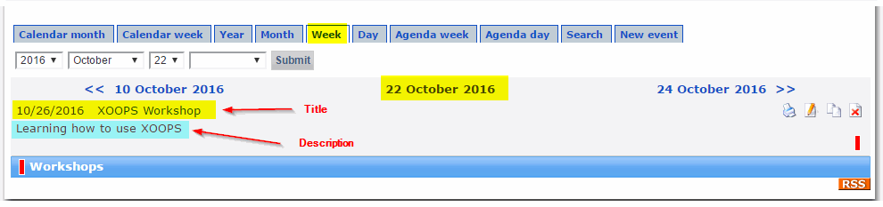

## Day \(list view\)

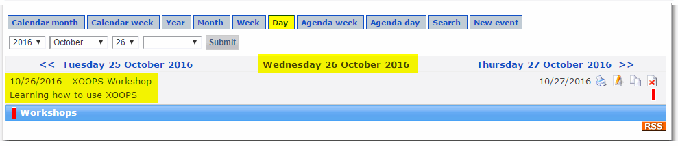

## Agenda week

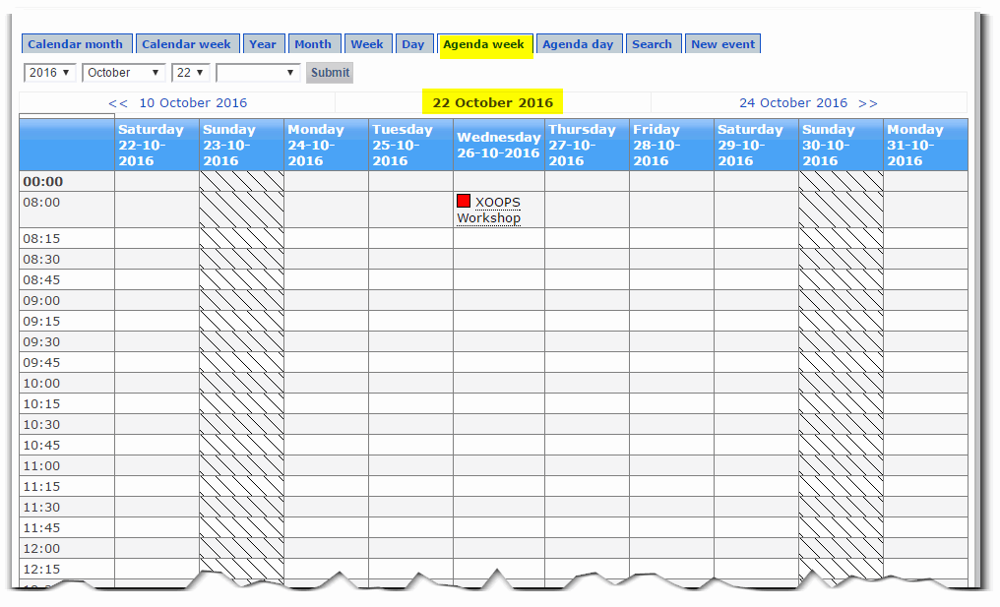 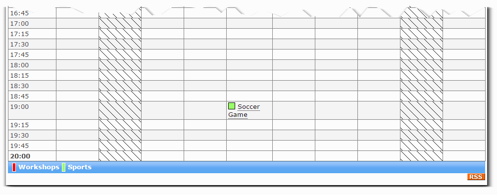

## Agenda day

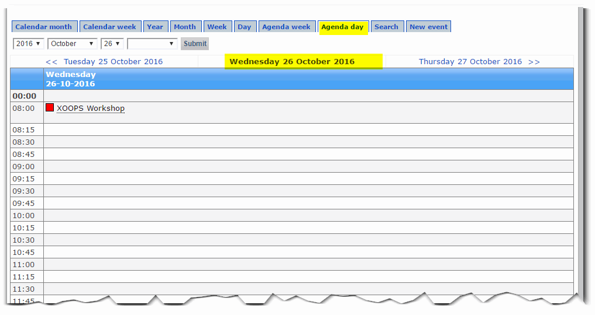

## Search

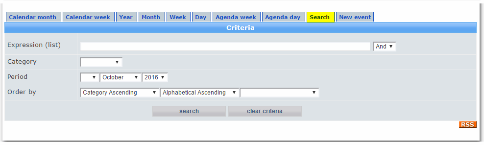

## New event

If you have the required permissions, you can add a new event:

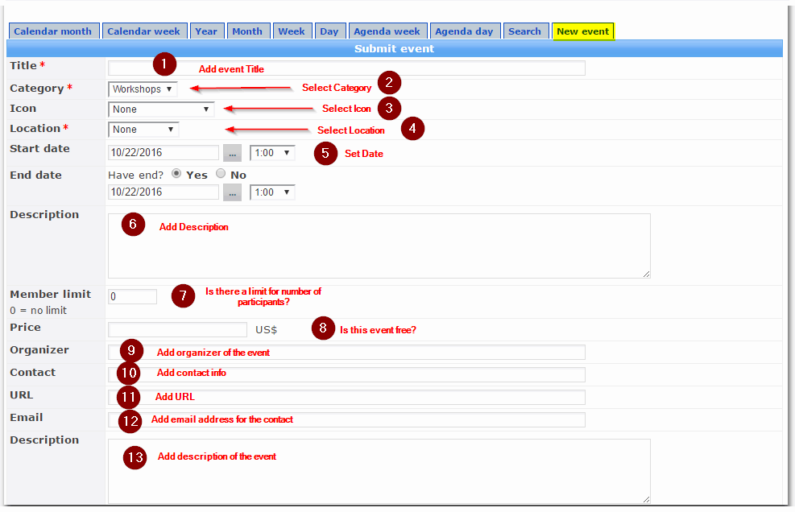

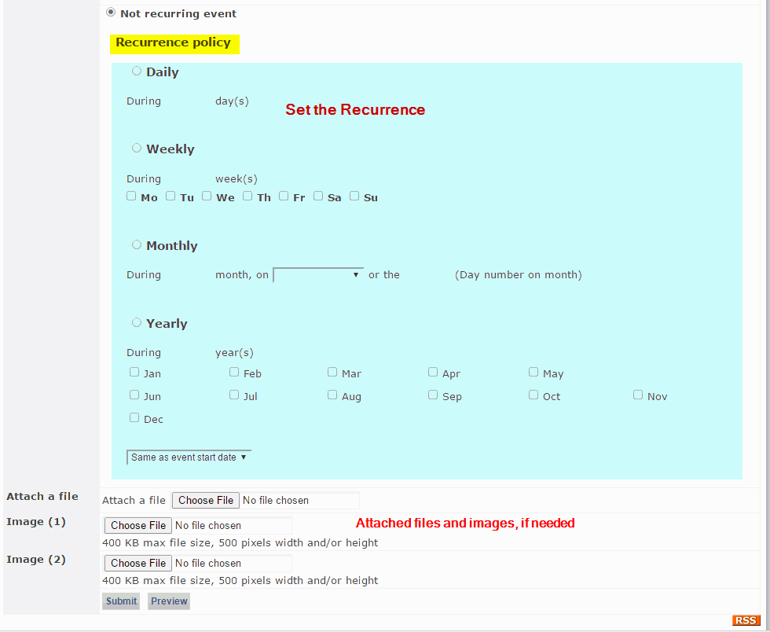

